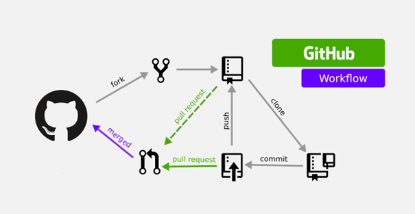

# Git Instructions
{: .no_toc }

## General workflow

We will be using github to manage uploading our results for the project and sharing work

[](https://dev.to/ambujsahu81/create-a-simple-github-actions-workflow-347n)

[Git cheat sheet](https://education.github.com/git-cheat-sheet-education.pdf)

## First time setup: how to install the project repository  

### 1. Fork the repo

Navigate to [https://github.com/jbirky/yupra](https://github.com/jbirky/yupra) on your browser. In the upper right corner, select the `Fork` button:


Choose yourself as the owner for the forked repo and check "copy main branch only":


(Note: Step 1 only needs to be done once.)

### 2. Clone repo to local computer

Now we want to `clone` our fork of the repository onto our local machine. We can put this in the same `research/` directory as our other files. 
To do this, change directories to your `research/` folder:
```bash
cd ~/research
```
Within the `research` directory, download the repo by using the `clone` command (and replacing `jbirky` in the url with your own github username):

```bash
git clone https://github.com/jbirky/yupra
```

If you type `ls`, you should now see all of the packages we've downloaded plus the yupra repo:
```bash
/research
	/alabi
	/vplanet
	/vplanet_inference
	/yupra
	...
```

Now we'll create a new folder within the yupra project to store our code and results. To do this, navigate to yupra directory and create a new folder with your name:
```bash
cd yupra
mkdir jbirky
```
This is the folder where you'll add all the code that you write (note: you only need to create this folder once).

### 3. Commit and push changes results to your fork

Copy the tutorial files to your personal folder:
```bash
cp -r tutorials/ jbirky/tutorials 
```

Now if you type `git status` you can check that git has tracked that new files have been added or modified, and the status command should show something like:
```bash
Untracked files:
  (use "git add <file>..." to include in what will be committed)
	jbirky/

```


### For more detailed instructions see here: 
- [How to fork a repo](https://docs.github.com/en/pull-requests/collaborating-with-pull-requests/working-with-forks/fork-a-repo)

- [How to update your fork](https://docs.github.com/en/pull-requests/collaborating-with-pull-requests/working-with-forks/syncing-a-fork)